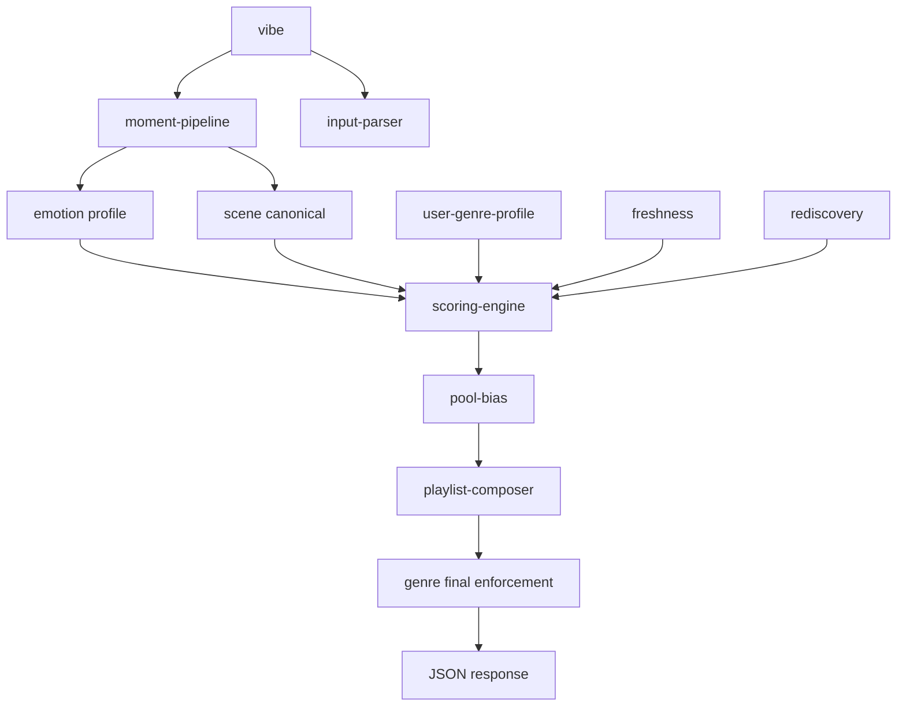

# Kwalify Backend — Architecture Cleanup Audit

Controlled refactor target: modular `core/` + `shared/` with **unchanged playlist outputs**.

---

## Step 1 — File map (purpose → dependencies → overlap risk)

### Scene intelligence

| File | Purpose | Key dependencies | Overlap risk |
|------|---------|------------------|--------------|
| `scene-types.ts` | Scene entry types | — | Low |
| `scene-library.ts` | Base scene bank | `scene-library-master`, `scene-library-extended` | Medium — 3 library files |
| `scene-library-master.ts` | Extended scene corpus | — | Medium |
| `scene-library-extended.ts` | More scenes | — | Medium |
| `scene-intelligence.ts` | Match experience scene → profile blend | `scene-library`, `emotion` | **High** — duplicates path with `analyzeVibeWithContext` |
| `scene-canonicalizer.ts` | Canonical scene ID + confidence | `scene-prototypes`, keywords | Medium |
| `scene-prototypes.ts` | Blueprint (genre affinity, sonic bias) | — | Low |
| `scene-validation.ts` | `sceneMatchScore`, `resolveSceneContext` | `scene-canonicalizer` | Low |
| `scene-sonic-map.ts` | Sonic trait map per scene | — | Low |
| `scene-sonic-profile.ts` | Track ↔ sonic profile fit | — | Low |
| `emotion-scene-layers.ts` | Time/environment phrase scoring | — | **High** — overlaps `analyzeVibe` keyword layers in `emotion.ts` |
| `scene-intelligence.ts` (moment) | Used by moment pipeline | — | — |
| `moment-pipeline.ts` | V2 pipeline: vibe → graph → physics → sonic | `emotion`, `scene-canonicalizer`, `knowledge-graph`, `scene-intelligence` | Orchestrator only |
| `knowledge-graph.ts` | Concept propagation | `knowledge-graph-types` | Low |
| `knowledge-graph-types.ts` | Typed edges | — | Low |
| `cross-graph.ts` | Cross-domain graph helpers | `knowledge-graph` | **Orphan** — no imports in repo |
| `emotional-physics.ts` | Profile physics modulation | — | Low |
| `intent-decoder.ts` | Human intent before scoring | — | Low |
| `negative-tags.ts` | Exclusion tags | — | Low |
| `seasonal-logic.ts` | Season/holiday gates | — | Medium — also in `hard-filters` |
| `hard-filters.ts` | Pre-score exclusions | `genre-taxonomy`, `seasonal-logic` | Low |

### Genre intelligence

| File | Purpose | Key dependencies | Overlap risk |
|------|---------|------------------|--------------|
| `genre-taxonomy.ts` | `classifyTrack`, locks, profiles | `genre-taxonomy-data` | **Canonical classifier** |
| `genre-taxonomy-data.ts` | Keyword rules | — | Low |
| `genre-detection-pipeline.ts` | Multi-pass library detection | `genre-taxonomy` | **High** — wraps `classifyTrack` + artist history |
| `genre-detector.ts` | Public API facade | `genre-detection-pipeline` | Low — not duplicate, thin wrapper |
| `user-genre-profile.ts` | User vector + classifications | `genre-detection-pipeline` | Low |
| `genre-ontology.ts` | 1000+ node tree | — | Low |
| `genre-embeddings.ts` | 384-d vectors + centroids | `genre-ontology` | Low |
| `genre-vector-store.ts` | In-memory vector store | `genre-embeddings` | Low |
| `genre-clustering.ts` | Micro-genres | `genre-embeddings` | Low |
| `genre-graph-edges.ts` | Edge builders | `genre-graph` types | Low |
| `genre-graph.ts` | Unified GenreGraph | ontology, embeddings, edges | Low |
| `genre-intelligence-stack.ts` | Stack orchestrator | `genre-graph` | Low |
| `genre-similarity-engine.ts` | Seed similarity boost | embeddings | Low |
| `genre-coverage.ts` | Pool bias toward underrepresented | taxonomy | Medium — vs enforcement |
| `genre-coverage-enforcement.ts` | Post-selection balance | coverage constants | Medium |
| `genre-audit.ts` | API audit payload | enforcement helpers | Low |
| `genre-identity-rules.ts` | Top-3 diversity floor | taxonomy | Low |
| `genre-scene-priority.ts` | Priority documentation + helpers | taxonomy | **Unused in scoring** — logic via `isGenreLocked` in hybrid |
| `genre-expansion-map.ts` | `genreMatchScore` | taxonomy | **Orphan** — exported, never imported |
| `genre-signature.ts` | Audio signature for affinity | — | Low |
| `anti-generic-fallback.ts` | Anti indie/lofi collapse | taxonomy | Low |

### Scoring engines (before consolidation)

| File | Purpose | Overlap risk |
|------|---------|--------------|
| `hybrid-scoring.ts` | **Primary** tri-score: scene 0.45 + library 0.35 + genre 0.20 | Canonical |
| `emotion.ts` → `scoreSong` | Per-track emotion fit | Used only inside hybrid |
| `genre-expansion-map.ts` | Alternate genre match | **Duplicate concept**, unused |
| `generate.ts` (inline) | Post-hybrid: rediscovery, archaeology, freshness multipliers | **Second scoring layer** |
| `playlist-freshness.ts` | Repetition penalty (multiplier) | Should run after base score ✓ |
| `reference-playlist.ts` | Reference bonus | Post-score ✓ |
| `forgotten-favourites.ts` | Rediscovery boost | Post-score ✓ |
| `library-archaeology.ts` | Archaeology boost | Post-score ✓ |
| `music-life-chapters.ts` | Chapter boost | Post-score ✓ |
| `genre-coverage.ts` | Sort-key bias | Pool stage, not hybrid |
| `genre-intelligence-stack.ts` | Embedding similarity boost | Pool stage |

### Playlist composition

| File | Purpose |
|------|---------|
| `emotion.ts` | `buildPlaylistStructure`, `filterDeadZones`, `smoothEnergyCurve`, `enforceArc`, `separateAdjacentArtists`, `limitArtistRepetition` |
| `narrative-roles.ts` | Role assignment |
| `controlled-surprise.ts` | Wildcard injection |
| `emotional-discovery.ts` | Rediscovery pool bias |
| `human-surprise.ts` | Surprise mix ratios |

### Memory / rediscovery

| File | Purpose |
|------|---------|
| `library-signals.ts` | Per-track library signals |
| `temporal-memory.ts` | Memory modifier for hybrid |
| `rediscovery.ts` | Deterministic jitter |
| `forgotten-favourites.ts` | Rediscovery scoring |
| `library-archaeology.ts` | Era/archaeology intent |
| `music-life-chapters.ts` | Life chapters |

### Input / explanation

| File | Purpose |
|------|---------|
| `emotion-destination.ts` | Journey destination parse |
| `multi-emotion.ts` | Mixed emotion detect |
| `prompt-confidence.ts` | Quality multiplier |
| `vibe-explanation.ts` | User-facing explanation |
| `moment-understanding.ts` | API moment payload |
| `scoring-explanation.ts` | Pipeline summary |

---

## Step 2 — Target architecture

```
src/
  core/
    input-parser/          # vibe → intent, destination, confidence
    emotion-engine/        # profile, moment pipeline, knowledge graph
    scene-intelligence/    # canonical scene, validation, prototypes (no genre writes)
    genre-intelligence/    # taxonomy, detection, graph, coverage, audit
    scoring-engine/        # SINGLE numeric pipeline (hybrid + post-score + pool bias)
    playlist-composer/     # structure, energy, surprise (selection only)
    memory-rediscovery/    # signals, temporal, archaeology, chapters
    anti-repetition/       # freshness penalties (post-score multipliers)
    playlist-pipeline.ts   # orchestrates generate flow
  shared/
    embeddings/            # genre embeddings + vector store
    types/                 # cross-cutting types (future)
  lib/                     # legacy paths — re-export from core where moved
  routes/
    generate.ts            # HTTP + DB only
```

**Data flow:** `vibe` → input-parser + emotion-engine + scene-intelligence → scoring-engine → playlist-composer → genre-intelligence (post) → anti-repetition already applied in scoring → response.

---

## Step 3 — Duplicates flagged (not removed)

| Issue | Files | Action |
|-------|-------|--------|
| Dual vibe→profile paths | `emotion.analyzeVibe`, `moment-pipeline`, `analyzeVibeWithContext` | Keep all; moment is primary in generate |
| Dual genre classification | `classifyTrack`, `detectTrackGenre`, `detectLibraryGenres` | Keep pipeline; taxonomy is leaf |
| Unused genre scene scorer | `genre-expansion-map.genreMatchScore` | Flagged orphan |
| Unused graph helper | `cross-graph.ts` | Flagged orphan |
| Unused priority module | `genre-scene-priority.ts` | Wired as docs + re-export; lock in hybrid |
| Surprise alias | `surprise-engine.ts` | Re-exports `controlled-surprise` only |
| Scene libraries ×3 | master + extended + base | Intentional layering; do not merge without corpus review |

---

## Step 4–5 — Consolidation rules (implemented in code)

**Single scoring engine** (`core/scoring-engine/`):

1. `scoreLibraryHybrid` — genre (mandatory) + scene (modifier) + emotion inside scene channel  
2. `applyPostScoreModifiers` — discovery, reference, memory, archaeology, chapter, confidence, journey, **freshness**  
3. `applyPoolBias` — sunny gate, genre fallback, coverage bias, embedding boost (does not restructure formula)

**Separation:**

- Genre modules never import `scene-intelligence` or `scene-canonicalizer`
- Scene modules never import `genre-ontology` or `genre-graph`
- Rediscovery boosts only in post-score / pool-bias / composer injection
- Freshness runs in post-score (multiplier), not inside tri-score

---

## Step 6 — Cleanup output

### Removed duplicates

**None** — no files deleted (orphans retained per safety rule).

### Merged / centralized (logic moved, old paths preserved)

| New module | Absorbs |
|------------|---------|
| `core/scoring-engine/index.ts` | Orchestrates hybrid + post + pool bias |
| `core/scoring-engine/post-score-modifiers.ts` | Former inline block in `generate.ts` |
| `core/scoring-engine/pool-bias.ts` | Sunny gate, fallback, coverage, stack |
| `core/playlist-composer/index.ts` | Structure + energy + surprise |
| `core/genre-intelligence/final-enforcement.ts` | Post-compose genre balance |
| `core/playlist-pipeline.ts` | End-to-end playlist build |

### Re-export shims (backward compatible)

| Legacy path | Points to |
|-------------|-----------|
| `lib/hybrid-scoring.ts` | Unchanged implementation; documented as scoring core |
| `core/*/index.ts` | Barrel re-exports |

### Dependency graph (simplified)



---

## Success criteria checklist

- [x] Scoring centralized in `core/scoring-engine`
- [x] Scene isolated under `core/scene-intelligence` exports
- [x] Genre isolated under `core/genre-intelligence` exports
- [x] `generate.ts` thinned to HTTP/DB + pipeline call
- [x] No scoring formula changes (extraction only)
- [ ] Run `npm run build` locally before deploy

---

## Optional (not implemented)

- Split `emotion.ts` into profile-parser vs composer
- Vector DB plugin layer (`genre-vector-store` hooks)
- Vibe engine plugin registry for A/B modules
